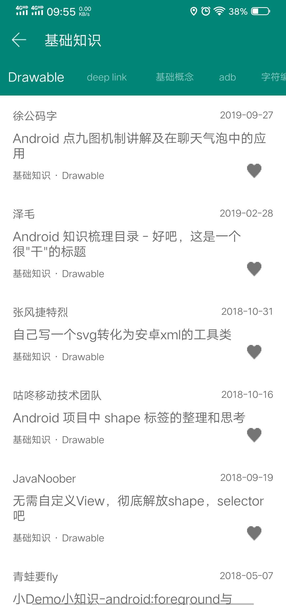

# PlayAndroid

**玩安卓客户端，练手之作**

>MVP+Retrofit+RxJava+OkHttp

_数据来自 <https://www.wanandroid.com/>_

### Screenshot

<table align="left">
    <tr>
        <td></td>
        <td></td>
        <td></td>
    </tr>
</table>

### 感谢开源

- [Glide](https://github.com/bumptech/glide)
- [Butter Knife](https://github.com/JakeWharton/butterknife)
- [Retrofit](https://github.com/square/retrofit)
- [RxJava](https://github.com/ReactiveX/RxJava)
- [BaseRecyclerViewAdapterHelper](https://github.com/CymChad/BaseRecyclerViewAdapterHelper)
- [SmartRefreshLayout](https://github.com/scwang90/SmartRefreshLayout)
- [MagicIndicator](https://github.com/hackware1993/MagicIndicator)
- [AndroidSwipeLayout](https://github.com/daimajia/AndroidSwipeLayout)
- [banner](https://github.com/youth5201314/banner)
- [RoundedImageView](https://github.com/vinc3m1/RoundedImageView)
- [BottomNavigation](https://github.com/Ashok-Varma/BottomNavigation)

### 下次目标

* 项目页面
* 集成社会化分享
* 加入侧滑返回
* 设置项